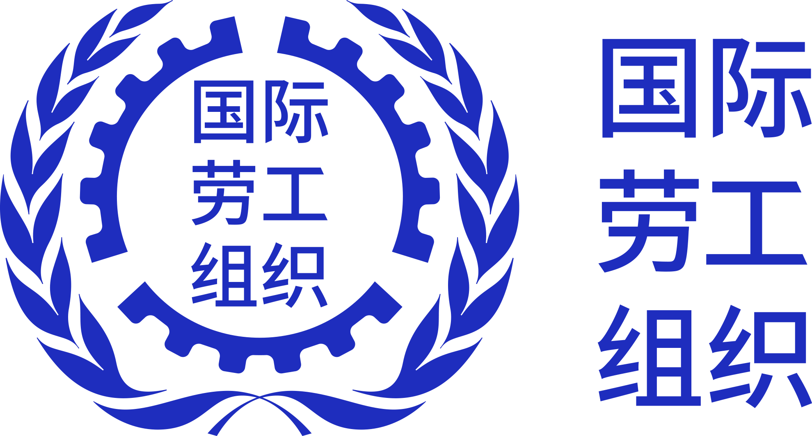
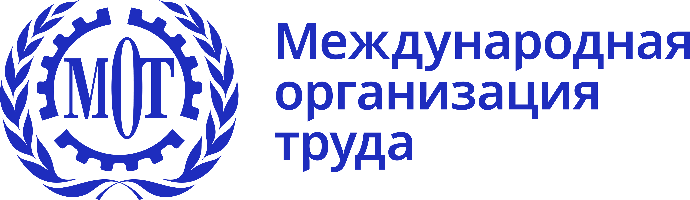

# ILO Design System - Brand Assets

Static brand assets for use in digital and software products using the ILO Design System.

## Installation

```bash
npm i @ilo-org/brand-assets
```

## Basic Usage

### 1. Import the image directly

This assumes that you're using a module bundler like [Webpack](https://webpack.js.org/) that will allow you to import the image into a JavaScript file and then include it in a production bundle where the import will be interpolated into a file path.

In this example, we're importing a logo from the from `@ilo-org/brand-assets` package and providing it to a [React](https://www.reactjs.com) component.

```jsx
import ilo_logo from "@ilo-org/brand-assets/logo_en_horizontal_blue.svg";

export const Logo = (props) => ;
```

If you're using [Next.js](https://nextjs.org/), you should use its [`next/image`](https://nextjs.org/docs/api-reference/next/image) component to do this.

### 2. Import the image URL

```jsx
import { logo_en_horizontal_blue } from "@ilo-org/brand-assets";

export const Logo = (props) => ;
```

This will give you a [URL object](https://developer.mozilla.org/en-US/docs/Web/API/URL) with normalized path to the file's location in the package. This is the easiest solution if you're able to serve them directly from the `node_modules` folder.

Conversely, it will not work in build systems that wont't serve assets from `node_modules` and that need to bundle them directly.

## List of Assets

Additional assets will be added to this package in future versions.

### ILO Logo

| Image                                                               | Language   | Filetype | Exported as                    | Filename                       |
| ------------------------------------------------------------------- | ---------- | -------- | ------------------------------ | ------------------------------ |
|   | English    | png      | `logo_en_horizontal_blue_png`  | `logo_en_horizontal_blue.png`  |
|   | English    | svg      | `logo_en_horizontal_blue_svg`  | `logo_en_horizontal_blue.svg`  |
|  | English    | png      | `logo_en_horizontal_white_png` | `logo_en_horizontal_white.png` |
|  | English    | svg      | `logo_en_horizontal_white_svg` | `logo_en_horizontal_white.svg` |
|   | French     | png      | `logo_fr_horizontal_blue_png`  | `logo_fr_horizontal_blue.png`  |
|   | French     | svg      | `logo_fr_horizontal_blue_svg`  | `logo_fr_horizontal_blue.svg`  |
|  | French     | png      | `logo_fr_horizontal_white_png` | `logo_fr_horizontal_white.png` |
|  | French     | svg      | `logo_fr_horizontal_white_svg` | `logo_fr_horizontal_white.svg` |
|   | Spanish    | png      | `logo_es_horizontal_blue_png`  | `logo_es_horizontal_blue.png`  |
|   | Spanish    | svg      | `logo_es_horizontal_blue_svg`  | `logo_es_horizontal_blue.svg`  |
|  | Spanish    | png      | `logo_es_horizontal_white_png` | `logo_es_horizontal_white.png` |
|  | Spanish    | svg      | `logo_es_horizontal_white_svg` | `logo_es_horizontal_white.svg` |
|   | Arabic     | png      | `logo_ar_horizontal_blue_png`  | `logo_ar_horizontal_blue.png`  |
|   | Arabic     | svg      | `logo_ar_horizontal_blue_svg`  | `logo_ar_horizontal_blue.svg`  |
|  | Arabic     | png      | `logo_ar_horizontal_white_png` | `logo_ar_horizontal_white.png` |
|  | Arabic     | svg      | `logo_ar_horizontal_white_svg` | `logo_ar_horizontal_white.svg` |
|   | Chinese    | png      | `logo_zh_horizontal_blue_png`  | `logo_zh_horizontal_blue.png`  |
|   | Chinese    | svg      | `logo_zh_horizontal_blue_svg`  | `logo_zh_horizontal_blue.svg`  |
|  | Chinese    | png      | `logo_zh_horizontal_white_png` | `logo_zh_horizontal_white.png` |
|  | Chinese    | svg      | `logo_zh_horizontal_white_svg` | `logo_zh_horizontal_white.svg` |
|   | Dutch      | png      | `logo_nl_horizontal_blue_png`  | `logo_nl_horizontal_blue.png`  |
|   | Dutch      | svg      | `logo_nl_horizontal_blue_svg`  | `logo_nl_horizontal_blue.svg`  |
|  | Dutch      | png      | `logo_nl_horizontal_white_png` | `logo_nl_horizontal_white.png` |
|  | Dutch      | svg      | `logo_nl_horizontal_white_svg` | `logo_nl_horizontal_white.svg` |
|   | German     | png      | `logo_de_horizontal_blue_png`  | `logo_de_horizontal_blue.png`  |
|   | German     | svg      | `logo_de_horizontal_blue_svg`  | `logo_de_horizontal_blue.svg`  |
|  | German     | png      | `logo_de_horizontal_white_png` | `logo_de_horizontal_white.png` |
|  | German     | svg      | `logo_de_horizontal_white_svg` | `logo_de_horizontal_white.svg` |
|   | Italian    | png      | `logo_it_horizontal_blue_png`  | `logo_it_horizontal_blue.png`  |
|   | Italian    | svg      | `logo_it_horizontal_blue_svg`  | `logo_it_horizontal_blue.svg`  |
|  | Italian    | png      | `logo_it_horizontal_white_png` | `logo_it_horizontal_white.png` |
|  | Italian    | svg      | `logo_it_horizontal_white_svg` | `logo_it_horizontal_white.svg` |
|   | Japanese   | png      | `logo_ja_horizontal_blue_png`  | `logo_ja_horizontal_blue.png`  |
|   | Japanese   | svg      | `logo_ja_horizontal_blue_svg`  | `logo_ja_horizontal_blue.svg`  |
|  | Japanese   | png      | `logo_ja_horizontal_white_png` | `logo_ja_horizontal_white.png` |
|  | Japanese   | svg      | `logo_ja_horizontal_white_svg` | `logo_ja_horizontal_white.svg` |
|   | Portuguese | png      | `logo_pt_horizontal_blue_png`  | `logo_pt_horizontal_blue.png`  |
|   | Portuguese | svg      | `logo_pt_horizontal_blue_svg`  | `logo_pt_horizontal_blue.svg`  |
|  | Portuguese | png      | `logo_pt_horizontal_white_png` | `logo_pt_horizontal_white.png` |
|  | Portuguese | svg      | `logo_pt_horizontal_white_svg` | `logo_pt_horizontal_white.svg` |
|   | Russian    | png      | `logo_ru_horizontal_blue_png`  | `logo_ru_horizontal_blue.png`  |
|   | Russian    | svg      | `logo_ru_horizontal_blue_svg`  | `logo_ru_horizontal_blue.svg`  |
|  | Russian    | png      | `logo_ru_horizontal_white_png` | `logo_ru_horizontal_white.png` |
|  | Russian    | svg      | `logo_ru_horizontal_white_svg` | `logo_ru_horizontal_white.svg` |
|   | Turkish    | png      | `logo_tr_horizontal_blue_png`  | `logo_tr_horizontal_blue.png`  |
|   | Turkish    | svg      | `logo_tr_horizontal_blue_svg`  | `logo_tr_horizontal_blue.svg`  |
|  | Turkish    | png      | `logo_tr_horizontal_white_png` | `logo_tr_horizontal_white.png` |
|  | Turkish    | svg      | `logo_tr_horizontal_white_svg` | `logo_tr_horizontal_white.svg` |
|   | Vietnamese | png      | `logo_vi_horizontal_blue_png`  | `logo_vi_horizontal_blue.png`  |
|   | Vietnamese | svg      | `logo_vi_horizontal_blue_svg`  | `logo_vi_horizontal_blue.svg`  |
|  | Vietnamese | png      | `logo_vi_horizontal_white_png` | `logo_vi_horizontal_white.png` |
|  | Vietnamese | svg      | `logo_vi_horizontal_white_svg` | `logo_vi_horizontal_white.svg` |

### Favicon

Various different favicon formats are available in the package. They are exported from the `/dist/favicon` directory. The following table lists the available formats and their dimensions.

| Image                                                                         | Description                        | Dimensions | Filetype |
|-------------------------------------------------------------------------------|------------------------------------|------------|----------|
|                        | `favicon.ico`                      | 32x32      | .ico     |
|                | `mstile-270x270x.png`              | 270x270    | .png     |
|              | `apple-touch-icon.png`             | 180x180    | .png     |
|  | `apple-touch-icon-precomposed.png` | 180x180    | .png     |
|        | `android-chrome-192x192.png`       | 192x192    | .png     |
|        | `android-chrome-512x512.png`       | 512x512    | .png     |
|             | `safari-pinned-tab.svg`            | -          | .svg     |
|         | `maskable-icon-192x192.png`        | 192x192    | .png     |
|         | `maskable-icon-512x512.png`        | 512x512    | .png     |

## Contributing

ILO Design System is an open-source project and we welcome your contributions! Before submitting a pull request, please take a moment to review the [contribution guidelines](./contributing.md).
